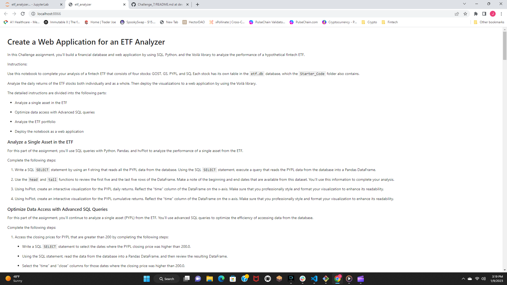
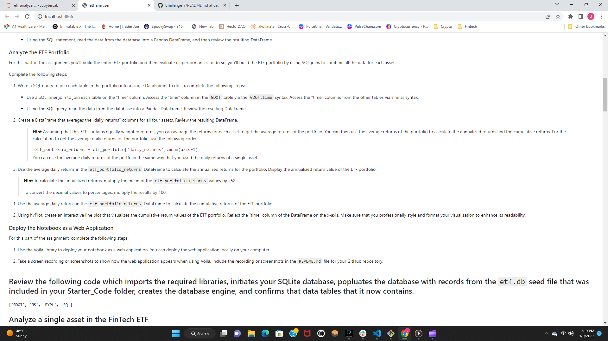

# *Module 7*
---
## Welcome to my ReadME file. Its been another hard week of wagie work but a successful and long week of coding!!! ##
# *in this readme file you will find a SQL file.* #

## **Purchasing 10 Ether as Wei**

## **Purchasing 1 Ether**

## **Withdraw Verification for acounts 1 a& 2**

